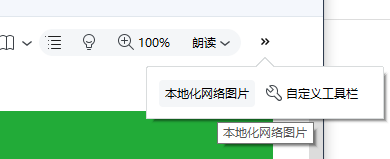

# 开发文档

### 参考链接

[4.4 版本插件开发API文档](http://www.wiz.cn/manual/plugin/)

[4.5 版本插件开发API文档](http://www.wiz.cn/plugin-api-document-45.html)

### 文件说明

`/Picture.Localize.wizplugin` 为插件文件，将 `/src` 下的文件打包成 `zip` 并更名为 `wizplugin` 即可。

# 插件介绍

### 插件名称

PictureLocalize（图片本地化）

### 插件位置
笔记顶部工具栏的**本地化网络图片**按钮，如下图：

### 使用方式

在笔记是**非编辑**的状态下，点击工具栏中的**本地化网络图片**按钮，稍等片刻后会出现**所有网络图片已经下载并转换到本地！**的提示。

兼容4.5以后的客户端版本，插件调试开发的环境是 `4.11.18` 版本。

- 考虑到编辑器很多，无法做到一一兼容，所以请在笔记是**非编辑**模式下使用该插件
- 点击按钮后的等待时间视网络情况不同
- 出现提示后即已更新笔记，会自动刷新，如需还原可通过**历史版本**功能恢复
- 兼容任意格式的笔记（Markdown 和 HTML），插件只会处理网络图片资源，笔记中引入的本地图片不会二次处理，放心使用！

### 插件用途

为笔记提供图片本地化功能，将笔记中所有的网络图片下载至笔记本地并替换，主要是为了解决以下几个问题：

1. 预防笔记图片为网络图片时，在离线环境下无法查看
2. 防止网络资源服务器关闭服务等无法访问的情况下，图片无法正常打开的问题

将所有图片下载并转换为笔记自带图片，有效的预防了上述可能遇到的问题，同时也可以很方便的进行导出等工具（解压ziw文件）

### 其他说明

因为个人在保存文档的过程中，遇到一些笔记在保存后仍然使用网络图片的情况（例如粘贴内容到Wiz.Editor.md编辑器中等），为了防止网络图片资源失效，特做了一个小插件以解决该问题，将图片保存至笔记中。

插件是以4.5以后的版本调试开发的，因为4.5版本前后的客户端插件开发方式不同，所以不保证4.5之前的客户端兼容性。

顺便的确想吐槽一些开发文档确实是有点乱，建议官方优化一下，这样也好让更多开发者为Wiz的插件生态做贡献不是吗？

